dbGaPCheckup Vignette
================
Lacey W. Heinsberg and Daniel E. Weeks

November 04, 2022

-   <a href="#1-copyright-information" id="toc-1-copyright-information">1
    Copyright information</a>
-   <a href="#2-overview" id="toc-2-overview">2 Overview</a>
-   <a href="#3-installation" id="toc-3-installation">3 Installation</a>
-   <a href="#4-data-format-file-types-and-file-names"
    id="toc-4-data-format-file-types-and-file-names">4 Data format, file
    types, and file names</a>
    -   <a href="#41-files" id="toc-41-files">4.1 Files</a>
    -   <a href="#42-subject-phenotype-data-set-ds"
        id="toc-42-subject-phenotype-data-set-ds">4.2 Subject Phenotype Data Set
        (DS)</a>
    -   <a href="#43-subject-phenotype-data-dictionary-dd"
        id="toc-43-subject-phenotype-data-dictionary-dd">4.3 Subject Phenotype
        Data Dictionary (DD)</a>
-   <a href="#5-execution-with-example-runs-and-interpretation"
    id="toc-5-execution-with-example-runs-and-interpretation">5 Execution
    with example runs and interpretation</a>
    -   <a href="#51-check-utility-and-awareness-functions"
        id="toc-51-check-utility-and-awareness-functions">5.1 Check, utility,
        and awareness functions</a>
        -   <a href="#511-example-1" id="toc-511-example-1">5.1.1 Example 1</a>
        -   <a href="#512-example-2" id="toc-512-example-2">5.1.2 Example 2</a>
        -   <a href="#513-example-3" id="toc-513-example-3">5.1.3 Example 3</a>
        -   <a href="#514-example-4" id="toc-514-example-4">5.1.4 Example 4</a>
        -   <a href="#515-example-5" id="toc-515-example-5">5.1.5 Example 5</a>
    -   <a href="#52-reporting-functions" id="toc-52-reporting-functions">5.2
        Reporting functions</a>
    -   <a href="#53-label-data-function" id="toc-53-label-data-function">5.3
        Label data function</a>
-   <a href="#6-appendix-reporting-functions"
    id="toc-6-appendix-reporting-functions">6 Appendix: Reporting
    functions</a>
    -   <a href="#61-appendix-a-awareness-report"
        id="toc-61-appendix-a-awareness-report">6.1 Appendix A: Awareness
        Report</a>
        -   <a href="#611-missingness-summary"
            id="toc-611-missingness-summary">6.1.1 Missingness Summary</a>
        -   <a href="#612-values-missing-tables"
            id="toc-612-values-missing-tables">6.1.2 Values Missing Tables</a>
            -   <a
                href="#6121-check-a-if-the-user-defines-a-missing-value-code-that-is-not-present-in-the-data-in-set-m-and-not-in-set-d"
                id="toc-6121-check-a-if-the-user-defines-a-missing-value-code-that-is-not-present-in-the-data-in-set-m-and-not-in-set-d">6.1.2.1
                Check A: If the user defines a missing value code that is not present in
                the data (In Set M and Not in Set D).</a>
            -   <a
                href="#6122-check-b-if-a-values-entry-defines-an-encoded-code-value-but-that-value-is-not-present-in-the-data-in-set-v-and-not-in-set-d"
                id="toc-6122-check-b-if-a-values-entry-defines-an-encoded-code-value-but-that-value-is-not-present-in-the-data-in-set-v-and-not-in-set-d">6.1.2.2
                Check B: If a VALUES entry defines an encoded code value, but that value
                is not present in the data (In Set V and Not in Set D).</a>
            -   <a
                href="#6123-check-c-if-the-user-defines-a-missing-value-code-that-is-not-defined-in-a-values-entry-in-set-m-and-not-in-set-v"
                id="toc-6123-check-c-if-the-user-defines-a-missing-value-code-that-is-not-defined-in-a-values-entry-in-set-m-and-not-in-set-v">6.1.2.3
                Check C: If the user defines a missing value code that is not defined in
                a VALUES entry (In Set M and Not in Set V).</a>
            -   <a
                href="#6124-check-d-if-a-user-defined-missing-value-code-is-present-in-the-data-for-a-given-variable-but-that-variable-does-not-have-a-corresponding-values-entry-m-in-set-d-and-not-in-set-v"
                id="toc-6124-check-d-if-a-user-defined-missing-value-code-is-present-in-the-data-for-a-given-variable-but-that-variable-does-not-have-a-corresponding-values-entry-m-in-set-d-and-not-in-set-v">6.1.2.4
                Check D: If a user-defined missing value code is present in the data for
                a given variable, but that variable does not have a corresponding VALUES
                entry (M in Set D and Not in Set V).</a>
    -   <a
        href="#62-check-e-if-a-values-entry-is-not-defined-as-a-missing-value-code-and-is-not-identified-in-the-data-set-v-values-that-are-not-in-set-m-that-are-not-in-set-d"
        id="toc-62-check-e-if-a-values-entry-is-not-defined-as-a-missing-value-code-and-is-not-identified-in-the-data-set-v-values-that-are-not-in-set-m-that-are-not-in-set-d">6.2
        Check E: If a VALUES entry is NOT defined as a missing value code AND is
        NOT identified in the data. ((Set V values that are NOT in Set M) that
        are NOT in Set D).</a>
    -   <a href="#63-appendix-b-data-report"
        id="toc-63-appendix-b-data-report">6.3 Appendix B: Data Report</a>
        -   <a href="#631-summary-and-plots" id="toc-631-summary-and-plots">6.3.1
            Summary and plots</a>
            -   <a href="#6311-age---integer" id="toc-6311-age---integer">6.3.1.1 AGE -
                integer</a>
            -   <a href="#6312-sex---integer-encoded-value"
                id="toc-6312-sex---integer-encoded-value">6.3.1.2 SEX - integer, encoded
                value</a>
            -   <a href="#6313-height---decimal-encoded-value"
                id="toc-6313-height---decimal-encoded-value">6.3.1.3 HEIGHT - decimal,
                encoded value</a>
            -   <a href="#6314-weight---decimal-encoded-value"
                id="toc-6314-weight---decimal-encoded-value">6.3.1.4 WEIGHT - decimal,
                encoded value</a>
-   <a href="#7-contact-information" id="toc-7-contact-information">7
    Contact information</a>
-   <a href="#8-acknowledgments" id="toc-8-acknowledgments">8
    Acknowledgments</a>

# 1 Copyright information

Copyright 2022, University of Pittsburgh. All Rights Reserved. License:
[GPL-2](https://www.gnu.org/licenses/old-licenses/gpl-2.0.en.html)

# 2 Overview

This document describes our R package, `dbGaPCheckup`, which implements
a series of check, awareness, utility, and reporting functions to help
you ensure your scientific data set meets [formatting
requirements](https://www.ncbi.nlm.nih.gov/gap/docs/submissionguide/)
for submission to the National Library of Medicine’s database of
Genotypes and Phenotypes ([dbGaP](https://www.ncbi.nlm.nih.gov/gap/)).

$$Paper citation to be added upon pre-print or publication$$.

This vignette was designed to give you a broad overview of the utility
of this R package. A complete table of functions and descriptions is
shown below. See the Quick Start (`dbGaPCheckup`) vignette for a brief
introduction to the package.

| Function_Name           | Function_Type         | Function_Description                                                                                                                                                                                                                                                                                                                  |
|:------------------------|:----------------------|:--------------------------------------------------------------------------------------------------------------------------------------------------------------------------------------------------------------------------------------------------------------------------------------------------------------------------------------|
| field_check             | check                 | Checks for dbGaP required fields: variable name (VARNAME), variable description (VARDESC), units (UNITS), and variable value and meaning (VALUES).                                                                                                                                                                                    |
| pkg_field_check         | check                 | Checks for package-level required fields: variable type (TYPE), minimum value (MIN), and maximum value (MAX).                                                                                                                                                                                                                         |
| dimension_check         | check                 | Checks that the number of variables match between the data set and data dictionary.                                                                                                                                                                                                                                                   |
| name_check              | check                 | Checks that variable names match between the data set and data dictionary.                                                                                                                                                                                                                                                            |
| id_check                | check                 | Checks that the first column of the data set is the primary ID for each participant labeled as SUBJECT_ID and that the values contain no spaces, padded zeros, or other illegal characters.                                                                                                                                           |
| row_check               | check                 | Checks for empty or duplicate rows in the data set.                                                                                                                                                                                                                                                                                   |
| NA_check                | check                 | Checks for NA values in the data set and, if NA values are present, also checks for an encoded NA value=meaning description.                                                                                                                                                                                                          |
| type_check              | check                 | If a TYPE field exists, this function checks for any TYPE entries that aren’t allowable per dbGaP instructions.                                                                                                                                                                                                                       |
| values_check            | check                 | Checks for potential errors in the VALUES columns by ensuring (1) required format of `VALUE=MEANING` (e.g., 0=No or 1=Yes); (2) no leading/trailing spaces near the equals sign (e.g., 0=No vs. 0 = No); (3) all variables of TYPE encoded have VALUES entries; and (4) all variables with VALUES entries are listed as TYPE encoded. |
| integer_check           | check                 | Checks for variables that appear to be incorrectly listed as TYPE integer.                                                                                                                                                                                                                                                            |
| decimal_check           | check                 | Checks for variables that appear to be incorrectly listed as TYPE decimal.                                                                                                                                                                                                                                                            |
| misc_format_check       | check                 | Checks miscellaneous dbGaP formatting requirements to ensure (1) no duplicate variable names; (2) variable names do not contain “dbgap”; (3) there are no duplicate column names in the dictionary; and (4) column names falling after VALUES column are unnamed.                                                                     |
| description_check       | check                 | Checks for unique and non-missing descriptions (VARDESC) for every variable in the data dictionary.                                                                                                                                                                                                                                   |
| minmax_check            | check                 | Checks for variables that have values exceeding the listed MIN or MAX.                                                                                                                                                                                                                                                                |
| missing_value_check     | check                 | Checks for variables that have non-encoded missing value codes.                                                                                                                                                                                                                                                                       |
| complete_check          | bulk check            | Runs the entire workflow (field_check, pkg_field_check, dimension_check, name_check, id_check, row_check, NA_check, type_check, values_check, integer_check, decimal_check, misc_format_check, description_check, minmax_check, and missing_value_check).                                                                             |
| add_missing_fields      | utility               | Adds additional fields required by this package including variable type (‘TYPE’), minimum value (‘MIN’), and maximum value (‘MAX’).                                                                                                                                                                                                   |
| name_correct            | utility               | Updates the data dictionary so variable names match those listed in the data set.                                                                                                                                                                                                                                                     |
| reorder_dictionary      | utility               | Reorders the data dictionary to match the data set.                                                                                                                                                                                                                                                                                   |
| reorder_data            | utility               | Reorders the data set to match the data dictionary.                                                                                                                                                                                                                                                                                   |
| id_first_data           | utility               | Reorders the data set so that SUBJECT_ID comes first.                                                                                                                                                                                                                                                                                 |
| id_first_dict           | utility               | Reorders the data dictionary so that SUBJECT_ID comes first.                                                                                                                                                                                                                                                                          |
| label_data              | utility, awareness    | Adds non-missing information from the data dictionary as attributes to the data.                                                                                                                                                                                                                                                      |
| value_meaning_table     | utility, awareness    | Generates a value-meaning table by parsing the VALUES fields.                                                                                                                                                                                                                                                                         |
| missingness_summary     | awareness             | Summarizes the amount of missingness in the data set.                                                                                                                                                                                                                                                                                 |
| value_missing_table     | awareness             | Checks for consistent usage of encoded values and missing value codes between the data dictionary and the data set.                                                                                                                                                                                                                   |
| dictionary_search       | awareness             | Facilitates searches of the data dictionary.                                                                                                                                                                                                                                                                                          |
| check_report            | bulk check, reporting | Generates a user-readable report of the checks run by the complete_check function.                                                                                                                                                                                                                                                    |
| create_report           | reporting, awareness  | Generates a textual and graphical report of the selected variables in HTML format.                                                                                                                                                                                                                                                    |
| create_awareness_report | reporting, awareness  | Generates an awareness report, calling missingness_summary and value_missing_table functions.                                                                                                                                                                                                                                         |

List of function names and types.

# 3 Installation

The package is written in R language.

To install from [CRAN](https://cran.r-project.org/), proceed as follows:

    install.packages("dbGaPCheckup")

To install the development version from [GitHub](https://github.com/),
proceed as follows:

1.  Install and load the `devtools` package by issuing these commands:

<!-- -->

    install.packages("devtools")
    library(devtools)

2.  Install and load the `dbGaPCheckup` by issuing these commands:

<!-- -->

    install_github("lwheinsberg/dbGaPCheckup/pkg")

If you wish to have this vignette installed and accessible within your R
help pages, use this command instead:

`install_github("lwheinsberg/dbGaPCheckup/pkg", build_opts = c("--no-resave-data", "--no-manual"), build_vignettes = TRUE)`

After the `dbGaPCheckup` package has been installed, you can view load
the package using this command:

``` r
library(dbGaPCheckup)
```

and view this vignette using:

`browseVignettes("dbGaPCheckup")`

# 4 Data format, file types, and file names

dbGaP has a host of [formatting
requirements](https://www.ncbi.nlm.nih.gov/gap/docs/submissionguide/)
for data set submission.

This package focuses on two required files: the Subject Phenotype data
set (DS) and the corresponding Subject Phenotype data dictionary (DD).
Brief instructions on setting up the files have been included below.

## 4.1 Files

Checks that are NOT currently embedded into this package that we want to
draw special attention to include:

1)  You may ONLY submit tab-delimited .txt and .xlsx files. –\>
    Tab-delimited txt files are preferable for the data set. –\> Excel
    (.xlsx) format is preferable for the data dictionary.

2)  File names should NOT contain special characters, spaces, hyphens,
    brackets, periods, or forward (/) or backward slashes (). –\> For
    example, ‘data.set.txt’, ‘data-set.txt’, ‘data set.txt’ are all
    illegal names, but ‘data_set.txt’ would be OK.

3)  Excel files are only allowed to have one sheet (i.e., no multiple
    tabs/sheets are allowed).

## 4.2 Subject Phenotype Data Set (DS)

In brief, the Subject Phenotype data set consists of the study data for
participants. In the data set, each row represents a participant, and
each column represents a study variable. The first column in the data
set needs to be labled `SUBJECT_ID` and contains the unique participant
identifier as an integer or string value. Integers should not have zero
padding or spaces. Specifically, only the following characters can be
included in the ID: English letters, Arabic numerals, period (.), hyphen
(-), underscore (\_), at symbol (@), and the pound sign (#). Columns
falling after `SUBJECT_ID` will be unique to a given study, but include
participant factors such as age, sex, etc. Formatting for an example
data set is shown below.

| SUBJECT_ID | SAMPLE_ID | AGE | SEX | PREGNANT |     HEIGHT |  WEIGHT |         BMI | OBESITY |    ABD_CIRC |   HIP_CIRC | ABD_SKF | SUP_SKF | RESIST | REACT | CUFFSIZE | BP_SYSTOLIC | BP_DIASTOLIC | HTN | SMOKING_HX | LENGTH_SMOKING_YEARS | HEART_RATE | PHYSICAL_ACTIVITY | HX_DM | HX_STROKE | HX_ANXIETY | HX_DEPRESSION | SOCIAL_SUPPORT | PERCEIVED_CONFLICT | PERCEIVED_HEALTH |
|-----------:|----------:|----:|----:|---------:|-----------:|--------:|------------:|--------:|------------:|-----------:|--------:|--------:|-------:|------:|---------:|------------:|-------------:|----:|-----------:|---------------------:|-----------:|------------------:|------:|----------:|-----------:|--------------:|---------------:|-------------------:|-----------------:|
|          1 |      1001 |  33 |   0 |    -4444 |   163.5000 |    54.4 |    20.34995 |       0 |   116.08677 |   119.2750 |      28 |      23 |    340 |    40 |        0 |         120 |           80 |   0 |          0 |              -4444.0 |         50 |               360 |     0 |         0 |          1 |             1 |              1 |                 25 |               10 |
|          2 |      1002 |  45 |   1 |        0 |   159.3369 |    93.2 |    36.70990 |       1 |   110.39444 |   115.8551 |      24 |      27 |    354 |    45 |        3 |         110 |           60 |   0 |      -9999 |              -4444.0 |         54 |                 0 |     1 |         0 |          0 |             0 |              5 |                 25 |                4 |
|          3 |      1003 |  34 |   0 |    -4444 |   185.0000 |    95.0 |    27.75749 |       0 |   104.29832 |   104.4375 |      29 |      25 |    358 |    55 |        1 |         106 |           50 |   0 |          1 |                  1.5 |         75 |               100 | -9999 |         0 |      -9999 |         -9999 |              4 |                 24 |                8 |
|          4 |     -9999 |  55 |   0 |    -4444 |   171.5000 |    85.7 |    29.13752 |       0 |   121.77705 |   118.4763 |      51 |      44 |    389 |    56 |        1 |         158 |           95 |   1 |          0 |              -4444.0 |         90 |               180 |     1 |         0 |          0 |             0 |              2 |                 10 |                5 |
|          5 |      1005 |  45 |   0 |    -4444 |   180.0000 |   101.4 |    31.29630 |       1 |    84.14132 |   104.6367 |      42 |      25 |    356 |    64 |        2 |         169 |          100 |   1 |          1 |                 14.0 |         85 |             -9999 |     1 |     -9999 |          0 |             0 |              3 |                  5 |                6 |
|          6 |      1006 |  46 |   1 |        0 | -9999.0000 | -9999.0 | -9999.00000 |   -9999 | -9999.00000 | -9999.0000 |   -9999 |   -9999 |  -9999 | -9999 |        0 |         105 |           40 |   0 |          1 |                 25.0 |         72 |               180 |     0 |         0 |          0 |             0 |              4 |                  1 |                7 |

First six lines of an example dbGaP data set.

Other example data set provided by dbGaP can be found at the NCBI
[submission
guide](https://www.ncbi.nlm.nih.gov/gap/docs/submissionguide/). See
“Example of a Subject Phenotypes DS File” and
“6a_SampleAttributes_DS.txt”.

## 4.3 Subject Phenotype Data Dictionary (DD)

In the Subject Phenotype data dictionary, each row represents a unique
variable (that corresponds to columns in the data set), and each column
represents information about that variable (see example below). For more
detailed data dictionary formatting instructions, visit the NCBI
[submission
guide](https://www.ncbi.nlm.nih.gov/gap/docs/submissionguide/) and see
heading “APPENDIX for Data Dictionary (DD) File Descriptions and
Specifications”, which includes a table of required and suggested column
headers and descriptions, as well as an example file called
“6b_SampleAttributes_DD.xlsx”.

| VARNAME    | VARDESC                        | DOCFILE | TYPE                   | UNITS | MIN | MAX | RESOLUTION | COMMENT1 | COMMENT2 | VARIABLE_SOURCE | SOURCE_VARIABLE_ID | VARIABLE_MAPPING | UNIQUEKEY | COLLINTERVAL | ORDER | VALUES              | …18      | …19                 | …20                                                      | …21 | …22 |
|:-----------|:-------------------------------|:--------|:-----------------------|:------|----:|----:|:-----------|:---------|:---------|:----------------|:-------------------|:-----------------|:----------|:-------------|:------|:--------------------|:---------|:--------------------|:---------------------------------------------------------|:----|:----|
| SUBJECT_ID | Participant ID                 | NA      | integer                | NA    |  NA |  NA | NA         | NA       | NA       | NA              | NA                 | NA               | NA        | NA           | NA    | NA                  | NA       | NA                  | NA                                                       | NA  | NA  |
| SAMPLE_ID  | Sample ID                      | NA      | integer, encoded value | NA    |  NA |  NA | NA         | NA       | NA       | NA              | NA                 | NA               | NA        | NA           | NA    | -9999=missing value | NA       | NA                  | NA                                                       | NA  | NA  |
| AGE        | Age at enrollment              | NA      | integer                | years |  NA |  NA | NA         | NA       | NA       | NA              | NA                 | NA               | NA        | NA           | NA    | NA                  | NA       | NA                  | NA                                                       | NA  | NA  |
| SEX        | Sex assigned at birth          | NA      | integer, encoded value | NA    |   0 |   1 | NA         | NA       | NA       | NA              | NA                 | NA               | NA        | NA           | NA    | 0=male              | 1=female | NA                  | NA                                                       | NA  | NA  |
| PREGNANT   | Pregnancy status at enrollment | NA      | integer, encoded value | NA    |   0 |   1 | NA         | NA       | NA       | NA              | NA                 | NA               | NA        | NA           | NA    | 0=no                | 1=yes    | -9999=missing value | -4444=not applicable, participant assigned male at birth | NA  | NA  |
| HEIGHT     | Height of participant          | NA      | decimal, encoded value | cm    |  NA |  NA | NA         | NA       | NA       | NA              | NA                 | NA               | NA        | NA           | NA    | -9999=missing value | NA       | NA                  | NA                                                       | NA  | NA  |

First six lines of an example dbGaP data dictionary.

Two special data dictionary formatting notes:

1)  The final columns of the data dictionary list all unique
    values/meanings of all encoded values, one value per cell, of which
    will vary based on the number of VALUE codes for a specific
    variable. For example, if your data set contains a variable called
    `SEX` in which 0 indicates female and 1 indicates male, these
    columns are designed to communicate `value=meaning` (e.g.,
    0=female). The `VALUES` header must be the last column header and
    should appear ONLY in the column above the FIRST encoded value that
    is listed. The remaining value column header cells should be left
    blank. (Note that when we read in our example data set with blank
    column names after `VALUES`, R automatically fills in the column
    names with the column number (e.g., `...18`, `...19`, etc.). This is
    acceptable for the package level checks, but not allowable for the
    files that are submitted to dbGaP.)

2)  This package requires several fields beyond those required by the
    dbGaP [formatting
    requirements](https://www.ncbi.nlm.nih.gov/gap/docs/submissionguide/).
    Specifically, dbGaP requires only that the data dictionary contains
    the following fields: variable name (`VARNAME`); variable
    description (`VARDESC`); units (`UNITS`); and variable value and
    meaning (`VALUE`). Because this package was designed to perform both
    dbGaP formatting requirement checks, as well as a series of
    awareness checks to help you ensure data accuracy, this package also
    requires that the data dictionary contains the following additional
    fields: minimum (`MIN`) and maximum (`MAX`) values (allowed to be
    left blank, but column headers are required) and the data type
    (e.g., integer, decimal, encoded value, string; `TYPE`) fields. If
    your data dictionary does not include these additional fields
    already, you can simply use the `add_missing_fields` function to
    auto fill them (see below).

# 5 Execution with example runs and interpretation

## 5.1 Check, utility, and awareness functions

Note that all “check” functions included in our package return an
invisible tibble that contains (1) Time (Time stamp); (2) Name (Name of
the function); (3) Status (Passed/Failed); (4) Message (A copy of the
message the function printed out); (5) Information (More detailed
information about the potential errors identified). This was designed to
streamline the complete workflow approach and to return a succinct
report back to you via `check_report` (see below). Note that there are
some dependencies between checks (e.g., name_check `values_check` is
dependent upon `field_check`), so there are pre-checks embedded within
many checks.

### 5.1.1 Example 1

``` r
data(ExampleD)
```

We recommend starting with the `check_report` function, which includes
15 embedded checks. Note that for all functions, you need to first
specify the name of the data dictionary, followed by the name of the
data set.

``` r
e1_report <- check_report(DD.dict.D, DS.data.D, non.NA.missing.codes=c(-4444, -9999))
#> # A tibble: 15 × 3
#>    Function            Status        Message                                                                     
#>    <chr>               <chr>         <chr>                                                                       
#>  1 field_check         Passed        Passed: required fields VARNAME, VARDESC, UNITS, and VALUES present in the …
#>  2 pkg_field_check     Failed        ERROR: not all package-level required fields are present in the data dictio…
#>  3 dimension_check     Passed        Passed: the variable count matches between the data dictionary and the data.
#>  4 name_check          Passed        Passed: the variable names match between the data dictionary and the data.  
#>  5 id_check            Passed        Passed: All ID variable checks passed.                                      
#>  6 row_check           Passed        Passed: no blank or duplicate rows detected.                                
#>  7 NA_check            Not attempted ERROR: Required pre-check pkg_field_check failed.                           
#>  8 type_check          Failed        ERROR: TYPE column not found. Consider using the add_missing_fields functio…
#>  9 values_check        Not attempted ERROR: Required pre-check type_check failed.                                
#> 10 integer_check       Not attempted ERROR: Required pre-check pkg_field_check failed.                           
#> 11 decimal_check       Not attempted ERROR: Required pre-check pkg_field_check failed.                           
#> 12 misc_format_check   Passed        Passed: no check-specific formatting issues identified.                     
#> 13 description_check   Failed        ERROR: missing and duplicate descriptions found in data dictionary.         
#> 14 minmax_check        Not attempted ERROR: Required pre-check pkg_field_check failed.                           
#> 15 missing_value_check Not attempted ERROR: Required pre-check pkg_field_check failed.                           
#> --------------------
#> pkg_field_check: Failed 
#> ERROR: not all package-level required fields are present in the data dictionary. Consider using the add_missing_fields function to auto fill these fields. 
#> $pkg_field_check.Info
#>  TYPE   MIN   MAX 
#> FALSE FALSE FALSE 
#> 
#> --------------------
#> type_check: Failed 
#> ERROR: TYPE column not found. Consider using the add_missing_fields function to autofill TYPE. 
#> $type_check.Info
#> [1] "ERROR: TYPE column not found."
#> 
#> --------------------
#> description_check: Failed 
#> ERROR: missing and duplicate descriptions found in data dictionary. 
#> $description_check.Info
#> # A tibble: 4 × 2
#>   VARNAME  VARDESC              
#>   <chr>    <chr>                
#> 1 PREGNANT <NA>                 
#> 2 REACT    <NA>                 
#> 3 HEIGHT   Height of participant
#> 4 WEIGHT   Height of participant
#> 
#> --------------------
```

In this check, we see that several checks passed (e.g., `field_check`),
some failed (e.g., `type_check`), and some could not be attempted
because a pre-check in the function failed (e.g.,
`missing_value_check`).

The `check_report` output can be examined to better understand the
issues at hand. For example, let’s examine the `pkg_field_check` results
more closely. You can call more detailed information for each check
using the following commands:

``` r
e1_report$Message[2]
#> [1] "ERROR: not all package-level required fields are present in the data dictionary. Consider using the add_missing_fields function to auto fill these fields."
e1_report$Information$pkg_field_check.Info
#>  TYPE   MIN   MAX 
#> FALSE FALSE FALSE
```

Here, we see that the `TYPE`, `MIN`, and `MAX` columns required for the
complete workflow approach in this package are missing. But never fear -
we can simply use the `add_missing_fields` function to add these in!

``` r
DD.dict_updated <- add_missing_fields(DD.dict.D, DS.data.D)
#> $Message
#> [1] "CORRECTED ERROR: not all package-level required fields were present in the data dictionary. The missing fields have now been added! TYPE was inferred from the data, and MIN/MAX have been added as empty fields."
#> 
#> $Missing
#> [1] "TYPE" "MIN"  "MAX"
```

Now that our error has been corrected, let’s return to `check_report`.
Don’t forget to call in the updated version of the data dictionary here!

``` r
e1_report.v2 <- check_report(DD.dict_updated, DS.data.D, non.NA.missing.codes=c(-4444, -9999)) # Note! Don't forget to call in the updated version of the data dictionary here! 
#> # A tibble: 15 × 3
#>    Function            Status Message                                                                            
#>    <chr>               <chr>  <chr>                                                                              
#>  1 field_check         Passed Passed: required fields VARNAME, VARDESC, UNITS, and VALUES present in the data di…
#>  2 pkg_field_check     Passed Passed: package-level required fields TYPE, MIN, and MAX present in the data dicti…
#>  3 dimension_check     Passed Passed: the variable count matches between the data dictionary and the data.       
#>  4 name_check          Passed Passed: the variable names match between the data dictionary and the data.         
#>  5 id_check            Passed Passed: All ID variable checks passed.                                             
#>  6 row_check           Passed Passed: no blank or duplicate rows detected.                                       
#>  7 NA_check            Passed Passed: no NA values detected in data set.                                         
#>  8 type_check          Passed Passed: All TYPE entries found are accepted by dbGaP per submission instructions.  
#>  9 values_check        Passed Passed: all four VALUES checks look good.                                          
#> 10 integer_check       Passed Passed: all variables listed as TYPE integer appear to be integers.                
#> 11 decimal_check       Passed Passed: all variables listed as TYPE decimal appear to be decimals.                
#> 12 misc_format_check   Passed Passed: no check-specific formatting issues identified.                            
#> 13 description_check   Failed ERROR: missing and duplicate descriptions found in data dictionary.                
#> 14 minmax_check        Passed Passed: when provided, all variables are within the MIN to MAX range.              
#> 15 missing_value_check Failed ERROR: some variables have non-encoded missing value codes.                        
#> --------------------
#> description_check: Failed 
#> ERROR: missing and duplicate descriptions found in data dictionary. 
#> $description_check.Info
#> # A tibble: 4 × 2
#>   VARNAME  VARDESC              
#>   <chr>    <chr>                
#> 1 PREGNANT <NA>                 
#> 2 REACT    <NA>                 
#> 3 HEIGHT   Height of participant
#> 4 WEIGHT   Height of participant
#> 
#> --------------------
#> missing_value_check: Failed 
#> ERROR: some variables have non-encoded missing value codes. 
#> $missing_value_check.Info
#>     VARNAME VALUE MEANING  PASS
#> 16 CUFFSIZE -9999    <NA> FALSE
#> 
#> --------------------
```

As you can see, now 13 out of 15 checks pass, but the workflow fails at
`description_check` and `missing_value_check`. Specifically, in
`description_check` we see that variables `PREGNANT` and `REACT` were
identified as having missing variable descriptions (`VARDESC`), and
variables `HEIGHT` and `WEIGHT` incorrectly have identical descriptions.
In `missing_value_check`, we see that the variable `CUFFSIZE` contains a
`-9999` encoded value that is not specified in a `VALUES` column. While
we have included several functions that support “quick fixes”
(`add_missing_fields`, `name_correct`, `reorder_dictionary`,
`reorder_data`, `id_first_data`, and `id_first_dict`), the issues
identified here are a bit more complex and study-specific, so would need
to be corrected manually in your data dictionary before moving on. For
now, we will leave this example and move on to the next one!

### 5.1.2 Example 2

``` r
data(ExampleL)
```

``` r
e2_report <- check_report(DD.dict.L, DS.data.L) 
#> # A tibble: 15 × 3
#>    Function            Status        Message                                                                     
#>    <chr>               <chr>         <chr>                                                                       
#>  1 field_check         Passed        Passed: required fields VARNAME, VARDESC, UNITS, and VALUES present in the …
#>  2 pkg_field_check     Passed        Passed: package-level required fields TYPE, MIN, and MAX present in the dat…
#>  3 dimension_check     Passed        Passed: the variable count matches between the data dictionary and the data.
#>  4 name_check          Failed        ERROR: the variable names DO NOT match between the data dictionary and the …
#>  5 id_check            Passed        Passed: All ID variable checks passed.                                      
#>  6 row_check           Passed        Passed: no blank or duplicate rows detected.                                
#>  7 NA_check            Not attempted ERROR: Required pre-check name_check failed.                                
#>  8 type_check          Passed        Passed: All TYPE entries found are accepted by dbGaP per submission instruc…
#>  9 values_check        Failed        ERROR: at least one VALUES check flagged potentials issues. See Information…
#> 10 integer_check       Not attempted ERROR: Required pre-check name_check failed.                                
#> 11 decimal_check       Not attempted ERROR: Required pre-check name_check failed.                                
#> 12 misc_format_check   Failed        ERROR: at least one check failed.                                           
#> 13 description_check   Failed        ERROR: missing and duplicate descriptions found in data dictionary.         
#> 14 minmax_check        Not attempted ERROR: Required pre-check name_check failed.                                
#> 15 missing_value_check Not attempted ERROR: Required pre-check name_check failed.                                
#> --------------------
#> name_check: Failed 
#> ERROR: the variable names DO NOT match between the data dictionary and the data. If the intention behind the variable names is correct, consider using the name_correct function to automatically rename variables to match. 
#> $name_check.Info
#> # A tibble: 2 × 2
#>   Data                Dict                 
#>   <chr>               <chr>                
#> 1 Data: SMOKING_HX    Dict: SMOKING_HISTORY
#> 2 Data: HX_DEPRESSION Dict: DEPRESSION_HX  
#> 
#> --------------------
#> values_check: Failed 
#> ERROR: at least one VALUES check flagged potentials issues. See Information for more details. 
#> $values_check.Info
#>    column_name values.check            vname                   type
#> 4      VALUES3        FALSE         CUFFSIZE integer, encoded value
#> 6       VALUES        FALSE              HTN integer, encoded value
#> 7       VALUES        FALSE PERCEIVED_HEALTH integer, encoded value
#> 9      VALUES5        FALSE               28 integer, encoded value
#> 10     VALUES4        FALSE               28 integer, encoded value
#> 12     VALUES2        FALSE               16 integer, encoded value
#> 14      VALUES        FALSE           RESIST integer, encoded value
#> 15      VALUES        FALSE        SAMPLE_ID                integer
#> 16      VALUES        FALSE              SEX                integer
#>                                                   problematic_description
#> 4                                                           2 means large
#> 6                                                          0 indicates no
#> 7  Between 1 and 10 with higher values indicating better perceived health
#> 9                                                        5 = a great deal
#> 10                                                        4 = quite a bit
#> 12                                                              1 =medium
#> 14                                                                   <NA>
#> 15                                                    -9999=missing value
#> 16                                                                 0=male
#>                                                                         check
#> 4                  Check 1: Is an equals sign present for all values columns?
#> 6                  Check 1: Is an equals sign present for all values columns?
#> 7                  Check 1: Is an equals sign present for all values columns?
#> 9  Check 2: Are there any leading/trailing spaces near the first equals sign?
#> 10 Check 2: Are there any leading/trailing spaces near the first equals sign?
#> 12 Check 2: Are there any leading/trailing spaces near the first equals sign?
#> 14  Check 3: Do all variables of TYPE encoded have at least one VALUES entry?
#> 15            Check 4: Are all variables with VALUES entries of TYPE encoded?
#> 16            Check 4: Are all variables with VALUES entries of TYPE encoded?
#> 
#> --------------------
#> misc_format_check: Failed 
#> ERROR: at least one check failed. 
#> $misc_formatting_check.Info
#> # A tibble: 7 × 6
#>   check.name check.description                           check.status details col.name correct
#>   <chr>      <chr>                                       <chr>        <chr>   <chr>    <lgl>  
#> 1 Check 1    Duplicate variable name check               Passed       <NA>    <NA>     NA     
#> 2 Check 2    Check for use of `dbgap` in variable names  Passed       <NA>    <NA>     NA     
#> 3 Check 4    Column names after `VALUES` should be empty Failed       <NA>    VALUES2  FALSE  
#> 4 Check 4    Column names after `VALUES` should be empty Failed       <NA>    VALUES3  FALSE  
#> 5 Check 4    Column names after `VALUES` should be empty Failed       <NA>    VALUES4  FALSE  
#> 6 Check 4    Column names after `VALUES` should be empty Failed       <NA>    VALUES5  FALSE  
#> 7 Check 4    Column names after `VALUES` should be empty Failed       <NA>    VALUES6  FALSE  
#> 
#> --------------------
#> description_check: Failed 
#> ERROR: missing and duplicate descriptions found in data dictionary. 
#> $description_check.Info
#> # A tibble: 2 × 2
#>   VARNAME  VARDESC
#>   <chr>    <chr>  
#> 1 PREGNANT <NA>   
#> 2 REACT    <NA>   
#> 
#> --------------------
```

In example 2, we see that the first three checks (`field_check`,
`pkg_field_check`, and `dimension_check`) and several others further
down the workflow pass, but the fourth check (`name_check`) fails.
Looking at the `check_report` output more closely, we see that there are
two variables with names that do not match between the data dictionary
and data set.

Before we move on to investigate this issue further, please note that we
could arrive at the same conclusion using the functions individually
(rather than the complete workflow approach implemented in
`check_report`):

``` r
field_check(DD.dict.L) # pass
#> $Message
#> [1] "Passed: required fields VARNAME, VARDESC, UNITS, and VALUES present in the data dictionary."
pkg_field_check(DD.dict.L) # pass
#> $Message
#> [1] "Passed: package-level required fields TYPE, MIN, and MAX present in the data dictionary."
dimension_check(DD.dict.L, DS.data.L) # pass
#> $Message
#> [1] "Passed: the variable count matches between the data dictionary and the data."
#> 
#> $Information
#> Variables in dictionary       Variables in data 
#>                      30                      30
name_check(DD.dict.L, DS.data.L) # failed
#> $Message
#> [1] "ERROR: the variable names DO NOT match between the data dictionary and the data. If the intention behind the variable names is correct, consider using the name_correct function to automatically rename variables to match."
#> 
#> $Information
#> # A tibble: 2 × 2
#>   Data                Dict                 
#>   <chr>               <chr>                
#> 1 Data: SMOKING_HX    Dict: SMOKING_HISTORY
#> 2 Data: HX_DEPRESSION Dict: DEPRESSION_HX
```

In looking more closely at the `name_check` output, we then see that,
while the “intent” between the names match (i.e., “hx” is sometimes used
as shorthand for “history”), there are a couple of discrepancies between
the data dictionary and data set. Luckily, we have included a “quick
fix” for this simple issue as implemented in the `name_correct` function
so that you can continue working through the checks. Specifically,
`name_correct` updates the names in the DS to match the names listed in
the data dictionary. Similarly, if the variable names in the data
dictionary and data set matched identically, but were in the wrong
order, the `reorder_dictionary` function could be used to create a new
version of the data dictionary to match the order presented in the data
set! Back to the example at hand, though – let’s give the `name_correct`
function a try now!

``` r
DS.data_updated <- name_correct(DD.dict.L, DS.data.L)
#> $Message
#> [1] "CORRECTED ERROR: the variable names differ between the data dictionary and the data. **ALERT** Renaming variable(s) to match those listed in the data dictionary."
#> 
#> $Information
#> # A tibble: 2 × 3
#>   Data                              Dict                             New.Data                     
#>   <chr>                             <chr>                            <chr>                        
#> 1 Original data name: SMOKING_HX    Dictionary name: SMOKING_HISTORY New data name:SMOKING_HISTORY
#> 2 Original data name: HX_DEPRESSION Dictionary name: DEPRESSION_HX   New data name:DEPRESSION_HX
```

Now that our error has been corrected, let’s return to `check_report`.
Similar to above, be sure to call in our updated data set!

``` r
e2_report.v2 <- check_report(DD.dict.L, DS.data_updated, non.NA.missing.codes=c(-4444, -9999)) # Calling in updated data set
#> Warning: Expected 2 pieces. Missing pieces filled with `NA` in 1 rows [3].
#> Warning: Expected 2 pieces. Missing pieces filled with `NA` in 1 rows [1].
#> Expected 2 pieces. Missing pieces filled with `NA` in 1 rows [1].
#> # A tibble: 15 × 3
#>    Function            Status Message                                                                            
#>    <chr>               <chr>  <chr>                                                                              
#>  1 field_check         Passed Passed: required fields VARNAME, VARDESC, UNITS, and VALUES present in the data di…
#>  2 pkg_field_check     Passed Passed: package-level required fields TYPE, MIN, and MAX present in the data dicti…
#>  3 dimension_check     Passed Passed: the variable count matches between the data dictionary and the data.       
#>  4 name_check          Passed Passed: the variable names match between the data dictionary and the data.         
#>  5 id_check            Passed Passed: All ID variable checks passed.                                             
#>  6 row_check           Passed Passed: no blank or duplicate rows detected.                                       
#>  7 NA_check            Passed Passed: no NA values detected in data set.                                         
#>  8 type_check          Passed Passed: All TYPE entries found are accepted by dbGaP per submission instructions.  
#>  9 values_check        Failed ERROR: at least one VALUES check flagged potentials issues. See Information for mo…
#> 10 integer_check       Failed ERROR: some variables listed as TYPE integer do not appear to be integers.         
#> 11 decimal_check       Failed ERROR: some variables listed as TYPE decimal do not appear to be decimals.         
#> 12 misc_format_check   Failed ERROR: at least one check failed.                                                  
#> 13 description_check   Failed ERROR: missing and duplicate descriptions found in data dictionary.                
#> 14 minmax_check        Failed ERROR: some variables have values outside of the MIN to MAX range.                 
#> 15 missing_value_check Failed ERROR: some variables have non-encoded missing value codes.                        
#> --------------------
#> values_check: Failed 
#> ERROR: at least one VALUES check flagged potentials issues. See Information for more details. 
#> $values_check.Info
#>    column_name values.check            vname                   type
#> 4      VALUES3        FALSE         CUFFSIZE integer, encoded value
#> 6       VALUES        FALSE              HTN integer, encoded value
#> 7       VALUES        FALSE PERCEIVED_HEALTH integer, encoded value
#> 9      VALUES5        FALSE               28 integer, encoded value
#> 10     VALUES4        FALSE               28 integer, encoded value
#> 12     VALUES2        FALSE               16 integer, encoded value
#> 14      VALUES        FALSE           RESIST integer, encoded value
#> 15      VALUES        FALSE        SAMPLE_ID                integer
#> 16      VALUES        FALSE              SEX                integer
#>                                                   problematic_description
#> 4                                                           2 means large
#> 6                                                          0 indicates no
#> 7  Between 1 and 10 with higher values indicating better perceived health
#> 9                                                        5 = a great deal
#> 10                                                        4 = quite a bit
#> 12                                                              1 =medium
#> 14                                                                   <NA>
#> 15                                                    -9999=missing value
#> 16                                                                 0=male
#>                                                                         check
#> 4                  Check 1: Is an equals sign present for all values columns?
#> 6                  Check 1: Is an equals sign present for all values columns?
#> 7                  Check 1: Is an equals sign present for all values columns?
#> 9  Check 2: Are there any leading/trailing spaces near the first equals sign?
#> 10 Check 2: Are there any leading/trailing spaces near the first equals sign?
#> 12 Check 2: Are there any leading/trailing spaces near the first equals sign?
#> 14  Check 3: Do all variables of TYPE encoded have at least one VALUES entry?
#> 15            Check 4: Are all variables with VALUES entries of TYPE encoded?
#> 16            Check 4: Are all variables with VALUES entries of TYPE encoded?
#> 
#> --------------------
#> integer_check: Failed 
#> ERROR: some variables listed as TYPE integer do not appear to be integers. 
#> $integer_check.Info
#> [1] "BP_DIASTOLIC"    "SMOKING_HISTORY"
#> 
#> --------------------
#> decimal_check: Failed 
#> ERROR: some variables listed as TYPE decimal do not appear to be decimals. 
#> $decimal_check.Info
#> [1] "ABD_SKF" "SUP_SKF"
#> 
#> --------------------
#> misc_format_check: Failed 
#> ERROR: at least one check failed. 
#> $misc_formatting_check.Info
#> # A tibble: 7 × 6
#>   check.name check.description                           check.status details col.name correct
#>   <chr>      <chr>                                       <chr>        <chr>   <chr>    <lgl>  
#> 1 Check 1    Duplicate variable name check               Passed       <NA>    <NA>     NA     
#> 2 Check 2    Check for use of `dbgap` in variable names  Passed       <NA>    <NA>     NA     
#> 3 Check 4    Column names after `VALUES` should be empty Failed       <NA>    VALUES2  FALSE  
#> 4 Check 4    Column names after `VALUES` should be empty Failed       <NA>    VALUES3  FALSE  
#> 5 Check 4    Column names after `VALUES` should be empty Failed       <NA>    VALUES4  FALSE  
#> 6 Check 4    Column names after `VALUES` should be empty Failed       <NA>    VALUES5  FALSE  
#> 7 Check 4    Column names after `VALUES` should be empty Failed       <NA>    VALUES6  FALSE  
#> 
#> --------------------
#> description_check: Failed 
#> ERROR: missing and duplicate descriptions found in data dictionary. 
#> $description_check.Info
#> # A tibble: 2 × 2
#>   VARNAME  VARDESC
#>   <chr>    <chr>  
#> 1 PREGNANT <NA>   
#> 2 REACT    <NA>   
#> 
#> --------------------
#> minmax_check: Failed 
#> ERROR: some variables have values outside of the MIN to MAX range. 
#> $minmax_check.Info
#> # A tibble: 1 × 5
#>   Trait              Check ListedMin ListedMax OutOfRangeValues
#>   <chr>              <lgl>     <dbl>     <dbl> <list>          
#> 1 PERCEIVED_CONFLICT FALSE         1        15 <int [11]>      
#> 
#> --------------------
#> missing_value_check: Failed 
#> ERROR: some variables have non-encoded missing value codes. 
#> $missing_value_check.Info
#>     VARNAME VALUE MEANING  PASS
#> 14   RESIST -9999    <NA> FALSE
#> 16 CUFFSIZE -9999    <NA> FALSE
#> 
#> --------------------
```

We now see that `name_check` now passes, along with several other
functions in the workflow, but we have failed on `values_check` and
several others.

Investigating this check failure further by looking at the
`check_report` output, we see a few issues that, due to the subjectivity
and complexity of different data set, will need to be manually corrected
before moving on. For the purposes of this tutorial, we will now leave
this data set to move on to a new one, but in reality, we would correct
this issue and return again to `check_report`.

### 5.1.3 Example 3

``` r
data(ExampleB)
```

Again, we will start with the `check_report` function.

``` r
e3_report <- check_report(DD.dict.B, DS.data.B)
#> # A tibble: 15 × 3
#>    Function            Status Message                                                                            
#>    <chr>               <chr>  <chr>                                                                              
#>  1 field_check         Passed Passed: required fields VARNAME, VARDESC, UNITS, and VALUES present in the data di…
#>  2 pkg_field_check     Passed Passed: package-level required fields TYPE, MIN, and MAX present in the data dicti…
#>  3 dimension_check     Passed Passed: the variable count matches between the data dictionary and the data.       
#>  4 name_check          Passed Passed: the variable names match between the data dictionary and the data.         
#>  5 id_check            Passed Passed: All ID variable checks passed.                                             
#>  6 row_check           Passed Passed: no blank or duplicate rows detected.                                       
#>  7 NA_check            Passed Passed: no NA values detected in data set.                                         
#>  8 type_check          Passed Passed: All TYPE entries found are accepted by dbGaP per submission instructions.  
#>  9 values_check        Passed Passed: all four VALUES checks look good.                                          
#> 10 integer_check       Passed Passed: all variables listed as TYPE integer appear to be integers.                
#> 11 decimal_check       Passed Passed: all variables listed as TYPE decimal appear to be decimals.                
#> 12 misc_format_check   Passed Passed: no check-specific formatting issues identified.                            
#> 13 description_check   Passed Passed: unique description present for all variables in the data dictionary.       
#> 14 minmax_check        Passed Passed: when provided, all variables are within the MIN to MAX range.              
#> 15 missing_value_check Passed Passed: all missing value codes have a corresponding VALUES entry.                 
#> [1] "All 15 checks passed."
```

In the above chunk, `check_report` determines that all 15 checks were
passed! But ALERT — this is misleading!!!!! Rerunning the check with our
missing value codes defined, we now see an issue at
`missing_value_check`, which underscores the importance of specifying
missing value codes.

``` r
e3_report.v2 <- check_report(DD.dict.B, DS.data.B, non.NA.missing.codes=c(-9999))
#> # A tibble: 15 × 3
#>    Function            Status Message                                                                            
#>    <chr>               <chr>  <chr>                                                                              
#>  1 field_check         Passed Passed: required fields VARNAME, VARDESC, UNITS, and VALUES present in the data di…
#>  2 pkg_field_check     Passed Passed: package-level required fields TYPE, MIN, and MAX present in the data dicti…
#>  3 dimension_check     Passed Passed: the variable count matches between the data dictionary and the data.       
#>  4 name_check          Passed Passed: the variable names match between the data dictionary and the data.         
#>  5 id_check            Passed Passed: All ID variable checks passed.                                             
#>  6 row_check           Passed Passed: no blank or duplicate rows detected.                                       
#>  7 NA_check            Passed Passed: no NA values detected in data set.                                         
#>  8 type_check          Passed Passed: All TYPE entries found are accepted by dbGaP per submission instructions.  
#>  9 values_check        Passed Passed: all four VALUES checks look good.                                          
#> 10 integer_check       Passed Passed: all variables listed as TYPE integer appear to be integers.                
#> 11 decimal_check       Passed Passed: all variables listed as TYPE decimal appear to be decimals.                
#> 12 misc_format_check   Passed Passed: no check-specific formatting issues identified.                            
#> 13 description_check   Passed Passed: unique description present for all variables in the data dictionary.       
#> 14 minmax_check        Passed Passed: when provided, all variables are within the MIN to MAX range.              
#> 15 missing_value_check Failed ERROR: some variables have non-encoded missing value codes.                        
#> --------------------
#> missing_value_check: Failed 
#> ERROR: some variables have non-encoded missing value codes. 
#> $missing_value_check.Info
#>     VARNAME VALUE MEANING  PASS
#> 13 CUFFSIZE -9999    <NA> FALSE
#> 
#> --------------------
```

If you are not immediately sure what your missing value codes are, you
can use our `value_meaning_table` utility/awareness function.

``` r
value_meaning_table(DD.dict.B)
#>                 VARNAME                   TYPE VALUE                               MEANING
#> 2             SAMPLE_ID integer, encoded value -9999                         missing value
#> 3                   SEX integer, encoded value     0                                  male
#> 4                   SEX integer, encoded value     1                                female
#> 5                HEIGHT decimal, encoded value -9999                         missing value
#> 6                WEIGHT decimal, encoded value -9999                         missing value
#> 7                   BMI decimal, encoded value -9999                         missing value
#> 8               OBESITY integer, encoded value     0                                    no
#> 9               OBESITY integer, encoded value     1                                   yes
#> 10              OBESITY integer, encoded value -9999                         missing value
#> 11             ABD_CIRC decimal, encoded value -9999                         missing value
#> 12             HIP_CIRC decimal, encoded value -9999                         missing value
#> 13              ABD_SKF integer, encoded value -9999                         missing value
#> 14              SUP_SKF integer, encoded value -9999                         missing value
#> 15               RESIST integer, encoded value -9999                         missing value
#> 16                REACT integer, encoded value -9999                         missing value
#> 17             CUFFSIZE integer, encoded value     0                                 small
#> 18             CUFFSIZE integer, encoded value     1                                medium
#> 19             CUFFSIZE integer, encoded value     2                                 large
#> 20             CUFFSIZE integer, encoded value     3                           extra large
#> 21          BP_SYSTOLIC integer, encoded value -9999                         missing value
#> 22         BP_DIASTOLIC integer, encoded value -9999                         missing value
#> 23                  HTN integer, encoded value     0                                    no
#> 24                  HTN integer, encoded value     1                                   yes
#> 25                  HTN integer, encoded value -9999                         missing value
#> 26           SMOKING_HX integer, encoded value     0                                    no
#> 27           SMOKING_HX integer, encoded value     1                                   yes
#> 28           SMOKING_HX integer, encoded value -9999                         missing value
#> 29 LENGTH_SMOKING_YEARS decimal, encoded value -9999                         missing value
#> 30 LENGTH_SMOKING_YEARS decimal, encoded value -4444 not applicable, no history of smoking
#> 31           HEART_RATE integer, encoded value -9999                         missing value
#> 32    PHYSICAL_ACTIVITY integer, encoded value -9999                         missing value
#> 33                HX_DM integer, encoded value     0                                    no
#> 34                HX_DM integer, encoded value     1                                   yes
#> 35                HX_DM integer, encoded value -9999                         missing value
#> 36            HX_STROKE integer, encoded value     0                                    no
#> 37            HX_STROKE integer, encoded value     1                                   yes
#> 38            HX_STROKE integer, encoded value -9999                         missing value
#> 39           HX_ANXIETY integer, encoded value     0                                    no
#> 40           HX_ANXIETY integer, encoded value     1                                   yes
#> 41           HX_ANXIETY integer, encoded value -9999                         missing value
#> 42        HX_DEPRESSION integer, encoded value     0                                    no
#> 43        HX_DEPRESSION integer, encoded value     1                                   yes
#> 44        HX_DEPRESSION integer, encoded value -9999                         missing value
#> 45       SOCIAL_SUPPORT integer, encoded value     1                           very little
#> 46       SOCIAL_SUPPORT integer, encoded value     2                                little
#> 47       SOCIAL_SUPPORT integer, encoded value     3                              moderate
#> 48       SOCIAL_SUPPORT integer, encoded value     4                           quite a bit
#> 49       SOCIAL_SUPPORT integer, encoded value     5                          a great deal
#> 50   PERCEIVED_CONFLICT integer, encoded value     1       lowest possible social conflict
#> 51   PERCEIVED_CONFLICT integer, encoded value    30      highest possible social conflict
#> 52     PERCEIVED_HEALTH integer, encoded value     1     poorest possible perceived health
#> 53     PERCEIVED_HEALTH integer, encoded value    10        best possible perceived health
```

So here we see that -9999 is a verified missing value code in this
example.

### 5.1.4 Example 4

``` r
data(ExampleH)
```

``` r
e4_report <- check_report(DD.dict.H, DS.data.H, non.NA.missing.codes=c(-4444, -9999))
#> # A tibble: 15 × 3
#>    Function            Status Message                                                                            
#>    <chr>               <chr>  <chr>                                                                              
#>  1 field_check         Passed Passed: required fields VARNAME, VARDESC, UNITS, and VALUES present in the data di…
#>  2 pkg_field_check     Passed Passed: package-level required fields TYPE, MIN, and MAX present in the data dicti…
#>  3 dimension_check     Passed Passed: the variable count matches between the data dictionary and the data.       
#>  4 name_check          Passed Passed: the variable names match between the data dictionary and the data.         
#>  5 id_check            Passed Passed: All ID variable checks passed.                                             
#>  6 row_check           Passed Passed: no blank or duplicate rows detected.                                       
#>  7 NA_check            Passed Passed: no NA values detected in data set.                                         
#>  8 type_check          Passed Passed: All TYPE entries found are accepted by dbGaP per submission instructions.  
#>  9 values_check        Passed Passed: all four VALUES checks look good.                                          
#> 10 integer_check       Failed ERROR: some variables listed as TYPE integer do not appear to be integers.         
#> 11 decimal_check       Passed Passed: all variables listed as TYPE decimal appear to be decimals.                
#> 12 misc_format_check   Passed Passed: no check-specific formatting issues identified.                            
#> 13 description_check   Passed Passed: unique description present for all variables in the data dictionary.       
#> 14 minmax_check        Passed Passed: when provided, all variables are within the MIN to MAX range.              
#> 15 missing_value_check Passed Passed: all missing value codes have a corresponding VALUES entry.                 
#> --------------------
#> integer_check: Failed 
#> ERROR: some variables listed as TYPE integer do not appear to be integers. 
#> $integer_check.Info
#> [1] "SUP_SKF"
#> 
#> --------------------
```

Note that in this example, we see an error at `integer_check`. Let’s
investigate this further.

Specifically, we can use the awareness function to grep (i.e., search)
this variable name in the dictionary

``` r
dictionary_search(DD.dict.H, search.term=c("SUP_SKF"), search.column=c("VARNAME"))
#> # A tibble: 1 × 22
#>   VARNAME VARDESC DOCFILE TYPE  UNITS   MIN   MAX RESOL…¹ COMME…² COMME…³ VARIA…⁴ SOURC…⁵ VARIA…⁶ UNIQU…⁷ COLLI…⁸
#>   <chr>   <chr>   <lgl>   <chr> <chr> <dbl> <dbl> <lgl>   <lgl>   <lgl>   <lgl>   <lgl>   <lgl>   <lgl>   <lgl>  
#> 1 SUP_SKF Suprai… NA      inte… mm       NA    NA NA      NA      NA      NA      NA      NA      NA      NA     
#> # … with 7 more variables: ORDER <lgl>, VALUES <chr>, ...18 <chr>, ...19 <chr>, ...20 <chr>, ...21 <chr>,
#> #   ...22 <chr>, and abbreviated variable names ¹​RESOLUTION, ²​COMMENT1, ³​COMMENT2, ⁴​VARIABLE_SOURCE,
#> #   ⁵​SOURCE_VARIABLE_ID, ⁶​VARIABLE_MAPPING, ⁷​UNIQUEKEY, ⁸​COLLINTERVAL
```

We can also look at the values in the data set to see that, in fact,
there are some values that are decimals (not integers as the dictionary
suggests).

``` r
table(DS.data.H$SUP_SKF)
#> 
#>  -9999     12     22 23.888     24     25     26     27     28 28.254     29     34     35     36     37     38 
#>      3      2      4      1      4     11      4      6      2      1      1      4      7      3      2      3 
#>     39  39.12     40     42     44     45     46     48     51     52 
#>      6      1      9      2      6      3      4      3      2      6
```

We can also use this awareness function to grep any variables that are
described as “skinfold” measurements to evaluate data `TYPE` across
variables.

``` r
dictionary_search(DD.dict.H, search.term=c("skinfold"))
#> # A tibble: 2 × 22
#>   VARNAME VARDESC DOCFILE TYPE  UNITS   MIN   MAX RESOL…¹ COMME…² COMME…³ VARIA…⁴ SOURC…⁵ VARIA…⁶ UNIQU…⁷ COLLI…⁸
#>   <chr>   <chr>   <lgl>   <chr> <chr> <dbl> <dbl> <lgl>   <lgl>   <lgl>   <lgl>   <lgl>   <lgl>   <lgl>   <lgl>  
#> 1 ABD_SKF Abdomi… NA      inte… mm       NA    NA NA      NA      NA      NA      NA      NA      NA      NA     
#> 2 SUP_SKF Suprai… NA      inte… mm       NA    NA NA      NA      NA      NA      NA      NA      NA      NA     
#> # … with 7 more variables: ORDER <lgl>, VALUES <chr>, ...18 <chr>, ...19 <chr>, ...20 <chr>, ...21 <chr>,
#> #   ...22 <chr>, and abbreviated variable names ¹​RESOLUTION, ²​COMMENT1, ³​COMMENT2, ⁴​VARIABLE_SOURCE,
#> #   ⁵​SOURCE_VARIABLE_ID, ⁶​VARIABLE_MAPPING, ⁷​UNIQUEKEY, ⁸​COLLINTERVAL
```

Above we see that both abdominal and suprailiac skinfold thickness are
listed as integers in the data dictionary, and thought to have been
measured to the nearest mm.

``` r
table(DS.data.H$ABD_SKF)
#> 
#> -9999    14    18    21    22    23    24    25    26    27    28    29    30    31    32    34    35    36 
#>     3     1     2     2     1     4    11    22     4     1     6     4     2     3     2     5     4     5 
#>    38    39    40    41    42    45    51    54    61    65    68 
#>     6     2     1     1     1     1     1     1     2     1     1
```

While `ABD_SKF` appears to be a true integer, `SUP_SKF` appears to have
some decimal places. This error could be corrected either by listing
`SUP_SKF` as `TYPE` decimal, or by investigating if the data set has a
recording error.

### 5.1.5 Example 5

``` r
data(ExampleA)
```

As mentioned above, if you prefer, you can also simply run the
individual checks that you are interested in rather than taking the
complete workflow approach. Note that several package-specific
pre-checks are embedded in many of the functions (e.g.,
`integer_check`).

``` r
id_check(DS.data.A)
#> $Message
#> [1] "Passed: All ID variable checks passed."
#> 
#> $Information
#> # A tibble: 4 × 4
#>   check.name check.description                                 check.status details                              
#>   <chr>      <chr>                                             <chr>        <chr>                                
#> 1 Check 1    Column 1 is labeled as 'SUBJECT_ID'.              Passed       The first column name is SUBJECT_ID. 
#> 2 Check 2    'SUBJECT_ID' is a column name in the data set.    Passed       'SUBJECT_ID' is the name of column 1.
#> 3 Check 3    'SUBJECT_ID' is a column name in the data set.    Passed       No illegal characters detected in 'S…
#> 4 Check 4    No leading zeros detected in 'SUBJECT_ID' column. Passed       No leading zeros detected in 'SUBJEC…
```

``` r
misc_format_check(DD.dict.A, DS.data.A) 
#> $Message
#> [1] "Passed: no check-specific formatting issues identified."
#> 
#> $Information
#> # A tibble: 3 × 4
#>   check.name check.description                           check.status details
#>   <chr>      <chr>                                       <chr>        <chr>  
#> 1 Check 1    Duplicate variable name check               Passed       <NA>   
#> 2 Check 2    Check for use of `dbgap` in variable names  Passed       <NA>   
#> 3 Check 4    Column names after `VALUES` should be empty Passed       <NA>
```

``` r
row_check(DS.data.A)
#> $Message
#> [1] "Passed: no blank or duplicate rows detected."
```

``` r
NA_check(DD.dict.A, DS.data.A)
#> $Message
#> [1] "Passed: no NA values detected in data set."
```

``` r
minmax_check(DD.dict.A, DS.data.A)
#> $Message
#> [1] "ERROR: some variables have values outside of the MIN to MAX range."
#> 
#> $Information
#> # A tibble: 1 × 5
#>   Trait    Check ListedMin ListedMax OutOfRangeValues
#>   <chr>    <lgl>     <dbl>     <dbl> <list>          
#> 1 PREGNANT FALSE         0         1 <int [2]>
```

Above we see that an issue has been discovered at `minmax_check`. Let’s
investigate this further. The approach to view the “out of range values”
is a bit cryptic, but it can be done with the following code.

``` r
b <- minmax_check(DD.dict.A, DS.data.A)
#> $Message
#> [1] "ERROR: some variables have values outside of the MIN to MAX range."
#> 
#> $Information
#> # A tibble: 1 × 5
#>   Trait    Check ListedMin ListedMax OutOfRangeValues
#>   <chr>    <lgl>     <dbl>     <dbl> <list>          
#> 1 PREGNANT FALSE         0         1 <int [2]>
b$Information[[1]]$OutOfRangeValues
#> [[1]]
#> [1] -4444 -9999
```

Here we see that we forgot to specify our missing value codes when we
ran `minmax_check`, so they are being flagged as errors. Let’s rerun the
command specifying -4444 and -9999 as missing value codes.

``` r
minmax_check(DD.dict.A, DS.data.A, non.NA.missing.codes=c(-4444, -9999))
#> $Message
#> [1] "Passed: when provided, all variables are within the MIN to MAX range."
```

Now we see that our check passed for this data set!

## 5.2 Reporting functions

We have also created awareness and reporting functions that are not
built into the complete workflow approach. These functions generate
graphical and textual descriptions and awareness checks of the data in
HTML format. These reports are designed to help you catch other
potential errors in your data set. Note that the `create_report`
generated is quite long however, so we recommend that you only submit
subsets of variables at a time. Specification of missing value codes are
also important for effective plotting. The commands are not ran here, as
they work best when initiated interactively.

    # Functions not run here as they work best when initiated interactively
    # Awareness Report (See Appendix A for more details)
    create_awareness_report(DD.dict, DS.data, non.NA.missing.codes=c(-9999, -4444),
       output.path= tempdir())
       
    # Data Report (See Appendix B for more details)
    create_report(DD.dict, DS.data, sex.split=TRUE, sex.name= "SEX",
       start = 3, end = 7, non.NA.missing.codes=c(-9999,-4444),
       output.path= tempdir(), open.html=TRUE)

For more details and to learn more, see the appendices below
(`create_awareness_report`, Appendix A; `create_report`, Appendix B).

## 5.3 Label data function

Note that after your data dictionary is fully consistent with your data,
you can use the `label_data` function to convert your data to labelled
data, essentially embedding the data dictionary into the data for future
use! This function uses Haven labelled data with SPSS style missing data
codes to add non-missing information from the data dictionary as
attributes to the data.

``` r
DS_labelled_data <- label_data(DD.dict.A, DS.data.A, non.NA.missing.codes=c(-9999))
labelled::var_label(DS_labelled_data$SEX)
#> [1] "Sex assigned at birth"
labelled::val_labels(DS_labelled_data$SEX)
#>   male female 
#>      0      1
attributes(DS_labelled_data$SEX)
#> $labels
#>   male female 
#>      0      1 
#> 
#> $label
#> [1] "Sex assigned at birth"
#> 
#> $class
#> [1] "haven_labelled" "vctrs_vctr"     "integer"       
#> 
#> $TYPE
#> [1] "integer, encoded value"
#> 
#> $MIN
#> [1] 0
#> 
#> $MAX
#> [1] 1
labelled::na_values(DS_labelled_data$HX_DEPRESSION)
#> missing value 
#>         -9999
```

# 6 Appendix: Reporting functions

As described above, there are a variety of awareness and reporting
functions that are not built into the complete workflow approach. The
purpose of this appendix is to highlight some of these features using
the following example data.

``` r
data(ExampleB)
```

## 6.1 Appendix A: Awareness Report

Run `create_awareness_report`, which creates a nice .Rmd version of the
below checks. While the output below is nearly identical to that you
will see using the `create_awareness_report` function, for the purposes
of this vignette, we have further expanded the annotation to assist in
interpretation of the output through an example.

    # Not run as works best when run interactively
    create_awareness_report(DD.dict, DS.data, non.NA.missing.codes=c(-9999),
       output.path= tempdir())

### 6.1.1 Missingness Summary

This awareness function summarizes the amount of missingness in the data
set.

``` r
missingness_summary(DS.data.B, non.NA.missing.codes = c(-9999), threshold = 95)
```

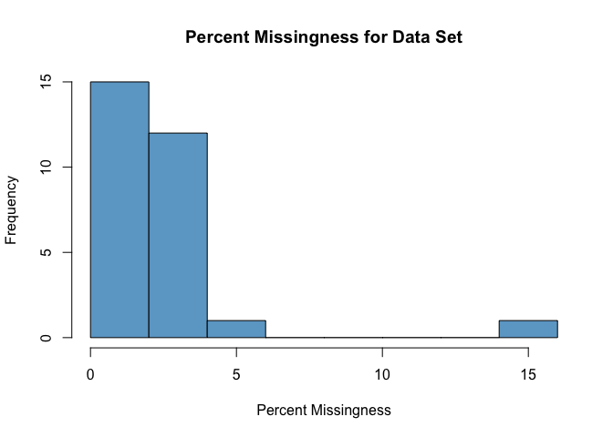<!-- -->

    #> $Message
    #> [1] "There are 0 variables with a percent missingness > 95% in your data set."
    #> 
    #> $threshold_summary
    #> [1] missing             percent_missingness
    #> <0 rows> (or 0-length row.names)
    #> 
    #> $full_missingness_summary
    #>                      missing percent_missingness
    #> SAMPLE_ID                 16                  16
    #> SMOKING_HX                 5                   5
    #> PHYSICAL_ACTIVITY          4                   4
    #> WEIGHT                     3                   3
    #> BMI                        3                   3
    #> OBESITY                    3                   3
    #> ABD_CIRC                   3                   3
    #> HIP_CIRC                   3                   3
    #> ABD_SKF                    3                   3
    #> SUP_SKF                    3                   3
    #> RESIST                     3                   3
    #> REACT                      3                   3
    #> HX_DM                      3                   3
    #> HX_STROKE                  3                   3
    #> HEIGHT                     2                   2
    #> CUFFSIZE                   2                   2
    #> BP_SYSTOLIC                2                   2
    #> BP_DIASTOLIC               2                   2
    #> HTN                        2                   2
    #> HX_ANXIETY                 2                   2
    #> HX_DEPRESSION              2                   2
    #> SUBJECT_ID                 0                   0
    #> AGE                        0                   0
    #> SEX                        0                   0
    #> LENGTH_SMOKING_YEARS       0                   0
    #> HEART_RATE                 0                   0
    #> SOCIAL_SUPPORT             0                   0
    #> PERCEIVED_CONFLICT         0                   0
    #> PERCEIVED_HEALTH           0                   0

Above we that there are 0 variables in our example data set that have a
percent missingness \>95%. Navigating through the output, we also see a
complete summary of missingness in our data set, with `SAMPLE_ID` having
the highest % missingness at 16%. Finally we see a histogram plotting
missingness across our data set.

### 6.1.2 Values Missing Tables

In the `value_missing_table` function, for each variable, we have three
sets of possible values:

1)  the set D of all the unique values observed in the data;  
2)  the set V of all the values explicitly encoded in the VALUES columns
    of the data dictionary; and  
3)  the set M of the missing value codes defined by the user via the
    `non.NA.missing.codes` argument.

This function examines various intersections of these three sets,
providing awareness checks about possible issues of concern.

``` r
results.list <- value_missing_table(DD.dict.B, DS.data.B, non.NA.missing.codes = c(-9999))
#> $Message
#> [1] "Flag: at least one check flagged."
#> 
#> $Information
#> # A tibble: 7 × 4
#>   check.name                     check.description                                               check…¹ details 
#>   <chr>                          <chr>                                                           <chr>   <named >
#> 1 Check A: In M, Not in D        "All missing value codes are in the data"                       Flag    <tibble>
#> 2 Check B: In V, Not in D        "All value codes are in the data"                               Flag    <tibble>
#> 3 Check C: In M, Not in V        "All missing value codes are in the VALUES"                     Flag    <tibble>
#> 4 Check D: In M & in D, not in V "All missing value codes are in the data and in values"         Flag    <tibble>
#> 5 Check E: V NOT in M, NOT in D  "All value codes no defined as a missing value code are in the… Passed  <chr>   
#> 6 Awareness: NsetD vs. NsetV     "Size of Set D vs size of set V"                                Info    <tibble>
#> 7 Awareness: N_DnotM vs. N_VnotM "Size of Set D\\M vs size of set V\\M"                          Info    <tibble>
#> # … with abbreviated variable name ¹​check.status
results <- results.list$report
```

#### 6.1.2.1 Check A: If the user defines a missing value code that is not present in the data (In Set M and Not in Set D).

| VARNAME              | AllMInD | NsetD | NsetM | NsetDAndSetM | MNotInD | MInD |
|:---------------------|:--------|------:|------:|-------------:|:--------|:-----|
| SEX                  | FALSE   |     2 |     1 |            0 | -9999   |      |
| LENGTH_SMOKING_YEARS | FALSE   |    12 |     1 |            0 | -9999   |      |
| HEART_RATE           | FALSE   |    44 |     1 |            0 | -9999   |      |
| SOCIAL_SUPPORT       | FALSE   |     5 |     1 |            0 | -9999   |      |
| PERCEIVED_CONFLICT   | FALSE   |    24 |     1 |            0 | -9999   |      |
| PERCEIVED_HEALTH     | FALSE   |    10 |     1 |            0 | -9999   |      |

Table Check A: List of variables for which user-defined missing value
code is not present in the data.

The above table lists the variables for which the user-defined missing
value code of `-9999` is not present in the data. These are not
necessarily errors, however, as `dbGaPCheckup` reads
`non.NA.missing.codes` as “global” missing value codes, even if a
specific variable does not contain the code. For example, in the example
data set, the SEX variable is complete, containing no missing value
codes and only containing encoded values of 0=male, and 1=female, but
`SEX` is flagged in the above variable list since it does not contain a
`-9999` value. In other words, this variable’s presence in the above
list is NOT an issue that we should be concerned about. This function is
attended only to bring awareness to potential errors in your data (e.g.,
perhaps you knew that the sex variable was missing for 5 participants
for your specific study.)

Interpretation of table column names:  
–\> `AllMInD`: Variable-specific check result communicating if
user-defined missing value code(s) are detected in the data set
(FALSE=no).  
–\> `NsetD`: Number of values (or levels) detected in the data (e.g., in
this example, `SEX` has two levels $$0=male, 1=female$$).  
–\> `NsetM`: Number of missing value codes defined (e.g., in this
example, 1 user-defined missing value code $$`-9999`$$ was defined).  
–\> `NsetDAndSetM`: Number of occurrences detected in both the data set
and the user-defined missing value code (e.g., here 0 overlap for these
variables, but if a second missing value code were defined, we might see
a 1 here).  
–\> `MNotInD`: User-defined missing value code the function checked for
(e.g., in this example, `-9999`).  
–\> `MInD`: Variable-specific number; user-defined missing value codes
detected in the data (e.g., in this example, 0).

#### 6.1.2.2 Check B: If a VALUES entry defines an encoded code value, but that value is not present in the data (In Set V and Not in Set D).

| VARNAME              | AllVsInD | NsetD | NsetV | NsetDAndSetV | VsNotInD |
|:---------------------|:---------|------:|------:|-------------:|:---------|
| LENGTH_SMOKING_YEARS | FALSE    |    12 |     2 |            1 | -9999    |
| HEART_RATE           | FALSE    |    44 |     1 |            0 | -9999    |

Table Check B: List of variables for which a VALUES entry defines an
encoded code value, but that value is not present in the data.

The above table lists variables for which a VALUES entry defines an
encoded value (i.e., value=meaning; e.g., 0=male), but that value is not
present in the data. While ideally all defined encoded values (i.e., in
set V) should be observed in the data (i.e., in set D), it is NOT
necessarily an error if one does not.

Interpretation of table column names:  
–\> `AllVsInD`: Check result communicating if all parsed VALUES entries
were detected in the data set (FALSE=no).  
–\> `NsetD`: Number of values (or levels) detected in the data (e.g., in
this example, `LENGTH_SMOKING_YEARS` has 12 unique levels).  
–\> `NsetV`: Number of encoded value codes detected (e.g., for this
example, `LENGTH_SMOKING_YEARS` has two encoded values).  
–\> `NsetDAndSetV`: Number of occurrences detected in both the data set
and the VALUES entries (e.g., for this example, `LENGTH_SMOKING_YEARS`
has one of the two encoded values detected in the data).  
–\> `VsNotInD`: Encoded value not detected in the data (e.g., for this
example, -9999 was not detected in either variable).

So this awareness check alerts us to two potential errors. Specifically,
-9999 is defined as a missing value code for `LENGTH_SMOKING_YEARS` and
`HEART_RATE`, but this code is not detected in the data itself.

``` r
# Smoking 
table(DS.data.B$LENGTH_SMOKING_YEARS)
#> 
#> -4444   0.5   1.5     5    10    14    15    25    44    45    50    52 
#>    84     1     1     1     1     1     3     2     2     1     2     1
dictionary_search(DD.dict.B, search.term=c("LENGTH_SMOKING_YEARS"), search.column=c("VARNAME"))
#> # A tibble: 1 × 21
#>   VARNAME VARDESC DOCFILE TYPE  UNITS   MIN   MAX RESOL…¹ COMME…² COMME…³ VARIA…⁴ SOURC…⁵ VARIA…⁶ UNIQU…⁷ COLLI…⁸
#>   <chr>   <chr>   <lgl>   <chr> <chr> <dbl> <dbl> <lgl>   <lgl>   <lgl>   <lgl>   <lgl>   <lgl>   <lgl>   <lgl>  
#> 1 LENGTH… How ma… NA      deci… years    NA    NA NA      NA      NA      NA      NA      NA      NA      NA     
#> # … with 6 more variables: ORDER <lgl>, VALUES <chr>, ...18 <chr>, ...19 <chr>, ...20 <chr>, ...21 <chr>, and
#> #   abbreviated variable names ¹​RESOLUTION, ²​COMMENT1, ³​COMMENT2, ⁴​VARIABLE_SOURCE, ⁵​SOURCE_VARIABLE_ID,
#> #   ⁶​VARIABLE_MAPPING, ⁷​UNIQUEKEY, ⁸​COLLINTERVAL

# Heart rate 
table(DS.data.B$HEART_RATE)
#> 
#>  38  45  46  47  48  49  50  52  54  55  56  57  58  59  60  64  65  67  68  72  73  74  75  76  78  79  82  83 
#>   1   5   1   1   2   1   1   2   2   1   3   1   5   1   1   1   8   1   2   2   1   1   9   3   1   1   1   1 
#>  85  86  90  91  95  96  98 100 105 107 110 113 114 115 125 135 
#>   9   2   2   1  13   1   1   1   1   1   3   1   1   1   1   1
dictionary_search(DD.dict.B, search.term=c("HEART_RATE"), search.column=c("VARNAME"))
#> # A tibble: 1 × 21
#>   VARNAME VARDESC DOCFILE TYPE  UNITS   MIN   MAX RESOL…¹ COMME…² COMME…³ VARIA…⁴ SOURC…⁵ VARIA…⁶ UNIQU…⁷ COLLI…⁸
#>   <chr>   <chr>   <lgl>   <chr> <chr> <dbl> <dbl> <lgl>   <lgl>   <lgl>   <lgl>   <lgl>   <lgl>   <lgl>   <lgl>  
#> 1 HEART_… Heart … NA      inte… beat…    NA    NA NA      NA      NA      NA      NA      NA      NA      NA     
#> # … with 6 more variables: ORDER <lgl>, VALUES <chr>, ...18 <chr>, ...19 <chr>, ...20 <chr>, ...21 <chr>, and
#> #   abbreviated variable names ¹​RESOLUTION, ²​COMMENT1, ³​COMMENT2, ⁴​VARIABLE_SOURCE, ⁵​SOURCE_VARIABLE_ID,
#> #   ⁶​VARIABLE_MAPPING, ⁷​UNIQUEKEY, ⁸​COLLINTERVAL
```

Looking at this more closely, we see a missing value code of -4444, not
-9999, is being used for `LENGTH_SMOKING_YEARS`, and `HEART_RATE` is a
complete variable with no missing data. -9999 could be removed as a
`VALUES` entry for those variables and -4444 should added as a
`non.NA.missing.value.code` for this function and example data set.

#### 6.1.2.3 Check C: If the user defines a missing value code that is not defined in a VALUES entry (In Set M and Not in Set V).

| VARNAME            | AllSetMInSetV | NsetV | NsetM | NsetMAndSetV | SetMsNotInSetV |
|:-------------------|:--------------|------:|------:|-------------:|:---------------|
| SEX                | FALSE         |     2 |     1 |            0 | -9999          |
| CUFFSIZE           | FALSE         |     4 |     1 |            0 | -9999          |
| SOCIAL_SUPPORT     | FALSE         |     5 |     1 |            0 | -9999          |
| PERCEIVED_CONFLICT | FALSE         |     2 |     1 |            0 | -9999          |
| PERCEIVED_HEALTH   | FALSE         |     2 |     1 |            0 | -9999          |

Table Check C: List of variables for which user-defined missing value
code(s) are not defined in a VALUES entry.

Interpretation of table column names:  
–\> `AllSetMInSetV`: Variable-specific check result communicating if
user-defined missing value code(s) are detected as a VALUES entry
(FALSE=no).  
–\> `NsetV`: Number of encoded value codes detected (e.g., in this
example, `SEX` has two levels $$0=male, 1=female$$).  
–\> `NsetM`: Number of missing value codes defined (e.g., in this
example, 1 user-defined missing value code $$`-9999`$$ was defined).  
–\> `NsetMAndSetD`: Number of occurrences detected in both the
user-defined missing value code and data set.  
–\> `SetMsNotInSetV`: Missing value code defined that was not detected
in the VALUES entries (e.g., here -9999).

#### 6.1.2.4 Check D: If a user-defined missing value code is present in the data for a given variable, but that variable does not have a corresponding VALUES entry (M in Set D and Not in Set V).

| VARNAME  | All_MInSetD_InSetV | setMInDNotInV |
|:---------|:-------------------|:--------------|
| CUFFSIZE | FALSE              | -9999         |

Table Check D: List of variables for which a user-defined missing value
code is present in the data for a given variable, but that variable does
not have a corresponding VALUES entry.

Interpretation of table column names:  
–\> `All_MInSetD_InSetV`: Variable-specific check result communicating
if user-defined missing value code(s) are detected in the data for a
given variable, but that variable does not have a corresponding VALUES
entry (FALSE=no).  
–\> `setMInDNotInV`: Encoded value codes detected in the data but not in
a corresponding VALUES entry.

Note that this check identified a true error! Specifically `CUFFSIZE`
has a missing value code in the data, -9999, that has not been defined
as an encoded value in the `VALUES` columns.

## 6.2 Check E: If a VALUES entry is NOT defined as a missing value code AND is NOT identified in the data. ((Set V values that are NOT in Set M) that are NOT in Set D).

| x      |
|:-------|
| Passed |

Table Check E: List of variables for which a VALUES entry is NOT defined
as a missing value code AND is NOT identified in the data

Interpretation of table column names:  
–\> `All_VNotInM_NotInD`: Variable-specific check result communicating
if encoded values that are NOT defined as a missing value code are
detected in the data (FALSE=no).  
–\> `setVNotInM_NotInD`: Encoded value codes detected as a VALUES entry
but NOT listed as a missing value code and NOT detected in the data.

In our example here, all VALUES entries that are NOT defined as missing
values codes are listed in the data - so our check passes.

## 6.3 Appendix B: Data Report

Next we can run `create_report`, which generates a textual and graphical
report of the selected variables in HTML format which will optionally
open the report in a web browser. This awareness report is designed to
help you catch other potential errors in your data set. Note that the
report generated is quite long however, so we recommend that you only
submit subsets of variables at a time. In the example below, for speed
of rendering, we create the report for variables only in columns 3
through 7. Note that there is an option to plot/report the data split by
sex if desired. Specification of missing value codes are also important
for effective plotting.

Again, the code below generates a nearly identical output to the
`create_report` function, with some additional annotation added here for
the purposes of this vignette and ease of interpretation.

    # Not run as works best when run interactively
    create_report(DD.dict, DS.data, sex.split=TRUE, sex.name= "SEX",
       start = 3, end = 7, non.NA.missing.codes=c(-9999,-4444),
       output.path= tempdir(), open.html=TRUE)

### 6.3.1 Summary and plots

    #> 
    #> Attaching package: 'dplyr'
    #> The following objects are masked from 'package:stats':
    #> 
    #>     filter, lag
    #> The following objects are masked from 'package:base':
    #> 
    #>     intersect, setdiff, setequal, union

``` r
dat_function_selected(DS.data.B, DD.dict.B, sex.split = TRUE, sex.name = "SEX", start = 3, end = 6, dataset.na=dataset.na, h.level=4)
```

#### 6.3.1.1 AGE - integer

Check passed: AGE is integer TYPE and all integers
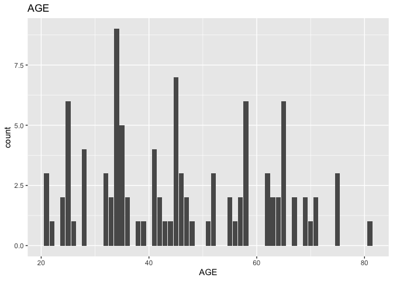<!-- -->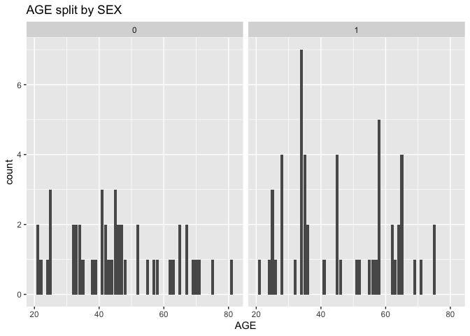<!-- -->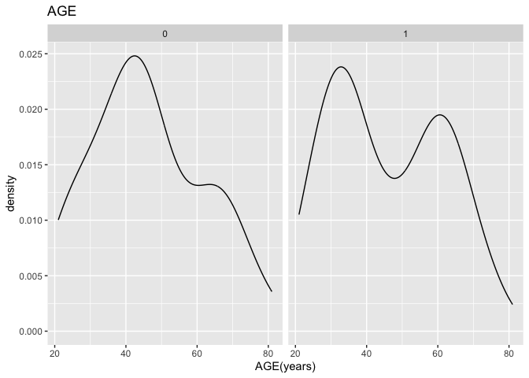<!-- --><!-- -->

-   AGE has no missing values.

-   AGE has no missing values after mapping missing codes to NA.

#### 6.3.1.2 SEX - integer, encoded value

Check passed: SEX is integer TYPE and all integers
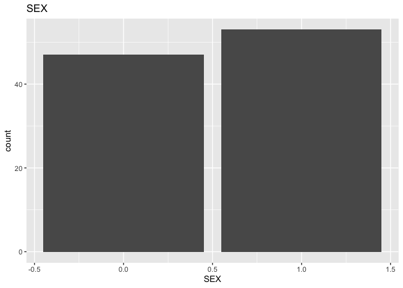<!-- -->

-   SEX has no missing values.

-   SEX has no missing values after mapping missing codes to NA.

#### 6.3.1.3 HEIGHT - decimal, encoded value

    #> Warning: Removed 2 rows containing non-finite values (stat_count).

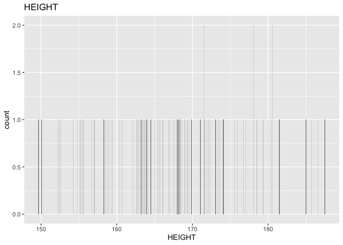<!-- -->

    #> Warning: Removed 2 rows containing non-finite values (stat_density).

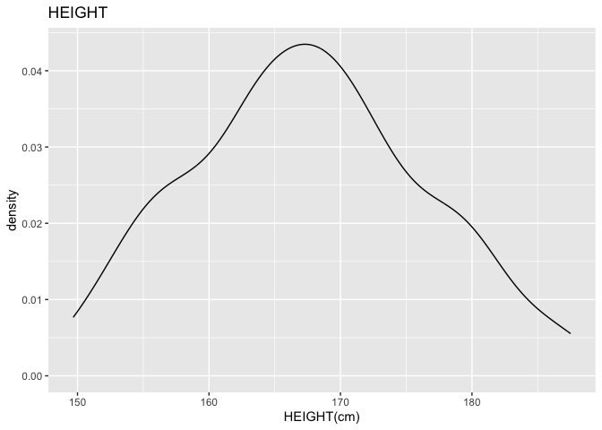<!-- -->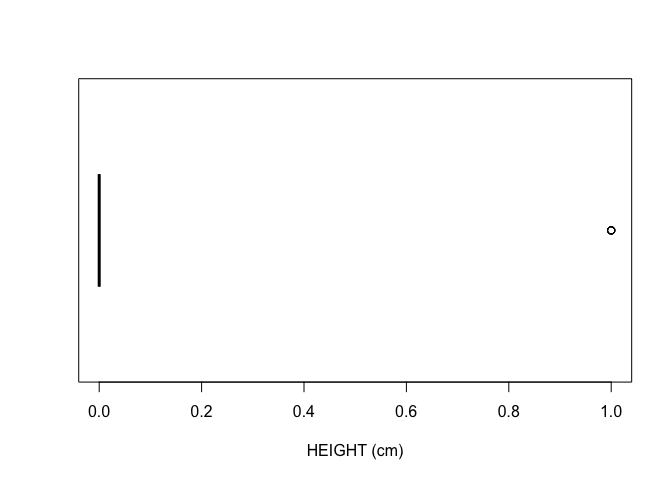<!-- -->

    #> Warning: Removed 2 rows containing non-finite values (stat_count).

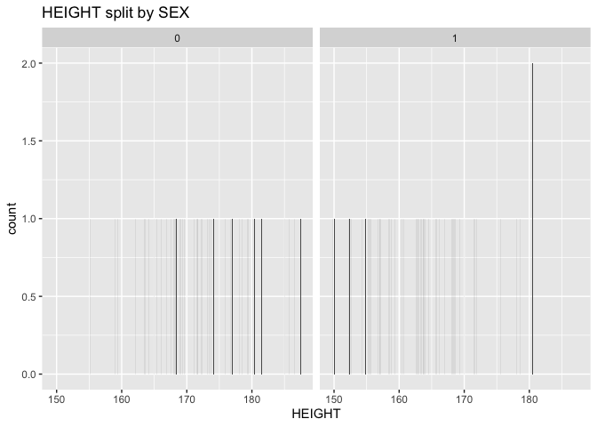<!-- -->

    #> Warning: Removed 2 rows containing non-finite values (stat_density).

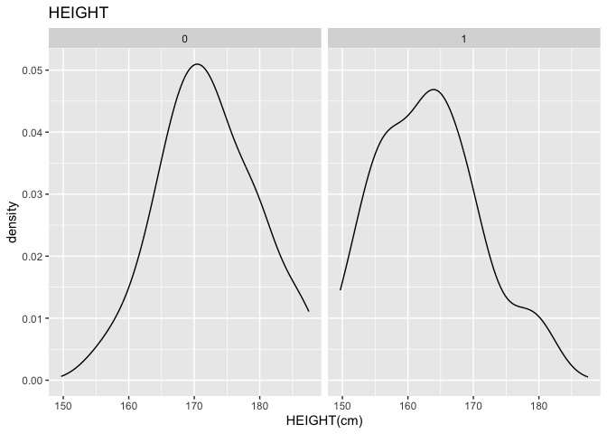<!-- -->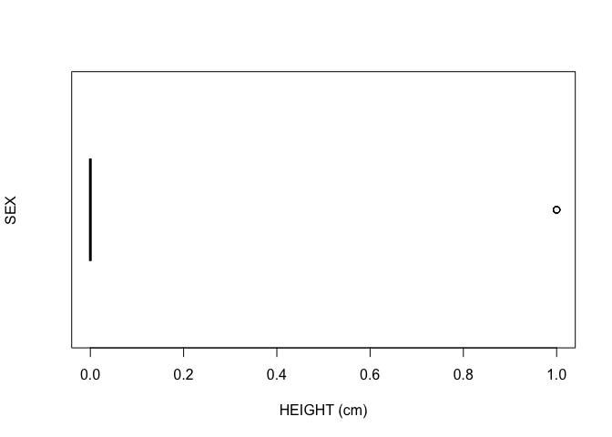<!-- -->

-   HEIGHT has no missing values.

-   There are 53 missing values for HEIGHT after mapping missing codes
    to NA.

#### 6.3.1.4 WEIGHT - decimal, encoded value

    #> Warning: Removed 3 rows containing non-finite values (stat_count).

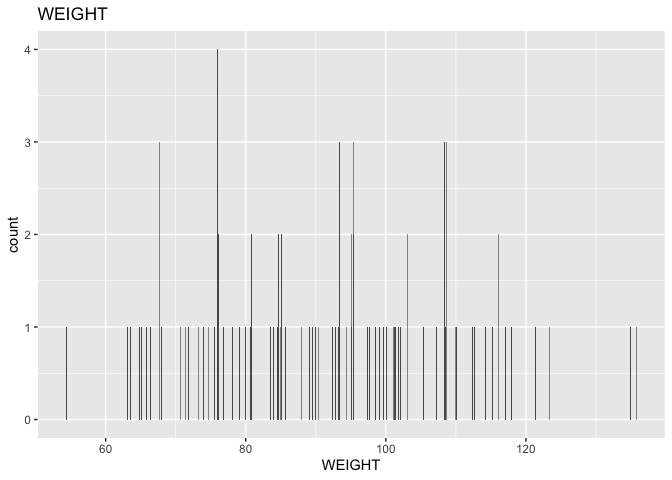<!-- -->

    #> Warning: Removed 3 rows containing non-finite values (stat_density).

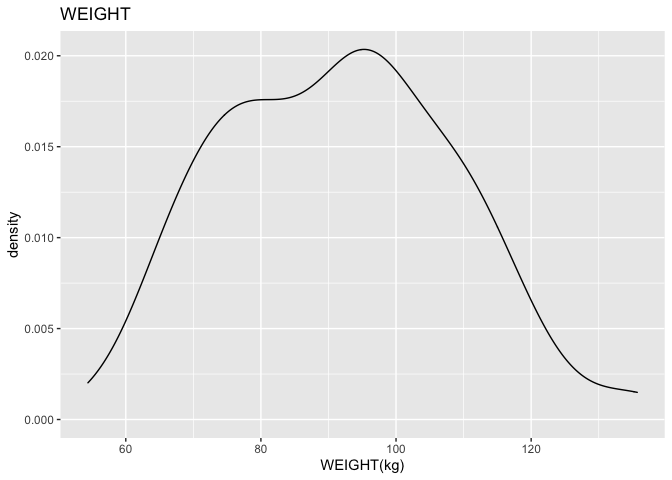<!-- -->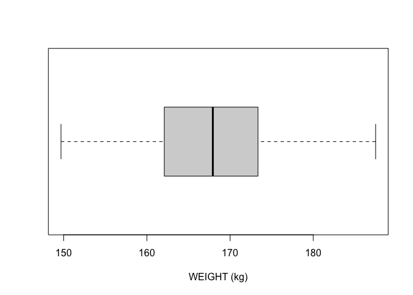<!-- -->

    #> Warning: Removed 3 rows containing non-finite values (stat_count).

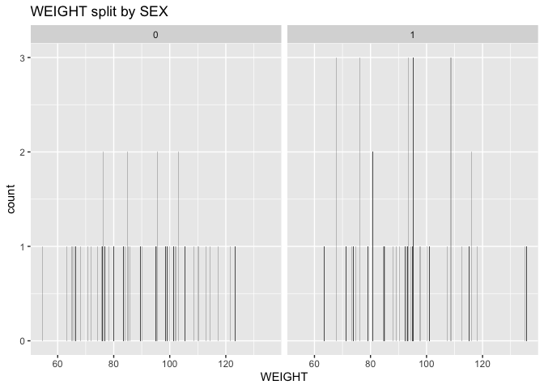<!-- -->

    #> Warning: Removed 3 rows containing non-finite values (stat_density).

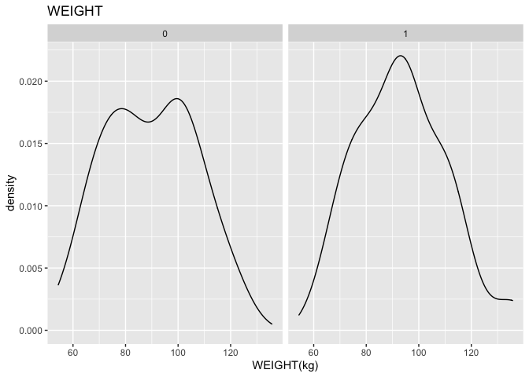<!-- -->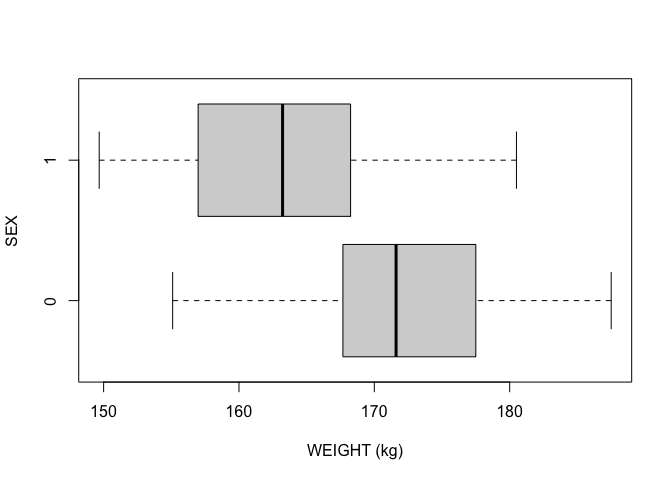<!-- -->

-   WEIGHT has no missing values.

-   There are 2 missing values for WEIGHT after mapping missing codes to
    NA.

Above we see a full report for variables `AGE`, `SEX`, `HEIGHT`, and
`WEIGHT` as well as `AGE`, `HEIGHT`, and `WEIGHT` split by sex. Given
the complexity of many data sets, this report was created so that
investigators could more easily manually review the data for potential
errors (e.g., sex=male appearing in a data of pregnant participants who
were all female assigned at birth).

# 7 Contact information

If you have any questions or comments, please feel free to contact us!

Lacey W. Heinsberg: <law145@pitt.edu>  
Daniel E. Weeks: <weeks@pitt.edu>

Bug reports: <https://github.com/lwheinsberg/dbGaPCheckup/issues>

# 8 Acknowledgments

This package was developed with partial support from the National
Institutes of Health under award numbers R01HL093093, R01HL133040, and
K99HD107030. The `eval_function` and `dat_function` functions that form
the backbone of the awareness reports were inspired by an elegant 2016
homework answer submitted by Tanbin Rahman in our HUGEN 2070 course
‘Bioinformatics for Human Genetics’. We would also like to acknowledge
Nick Moshgat for testing and providing feedback on our package.
